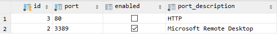

# Network-Scanner

Simple network scanner using database as task configuration source and results store.


Setup
============
Steps to set this up and running.


Dependencies
-----
Run `yarn install`.


Env variables
-----
Create `.env` file at root of this project.

Place following in with your details
```dotenv
DB_DIALECT=postgres
DB_USER=
DB_HOST=
DB_DATABASE=networkscanner
DB_PASSWORD=
DB_PORT=5432

SCAN_DELAY_MS=50
```

Run process once to create db and tables via `node network-scanner.js`


Database config
-----
Define ports to scan at `ports` table. Use enabled to toggle will it be scanned.
 

Define scan tasks at `scans` table like so.
 

Run the app to see some magic.
